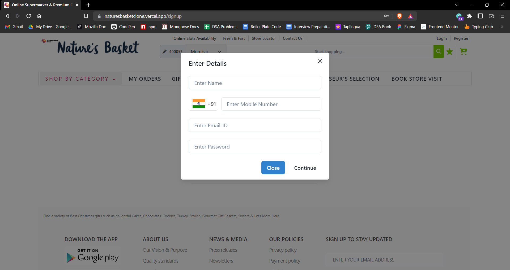
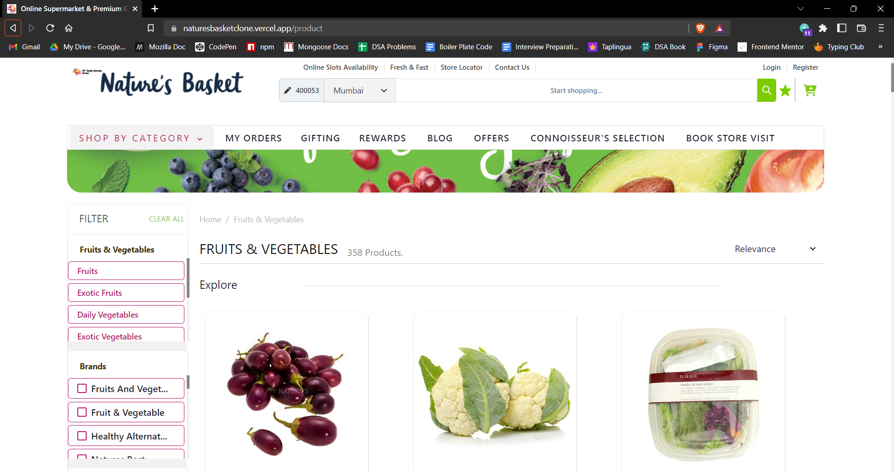
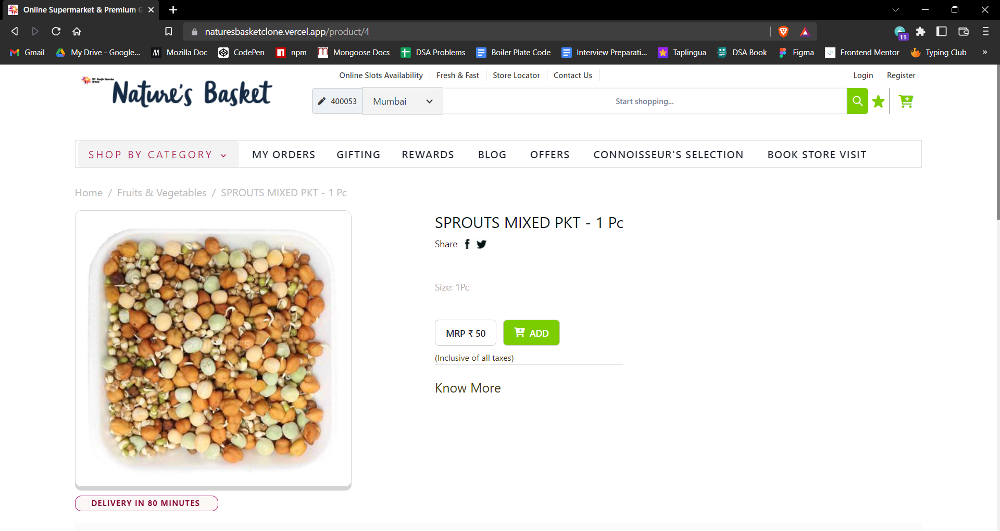
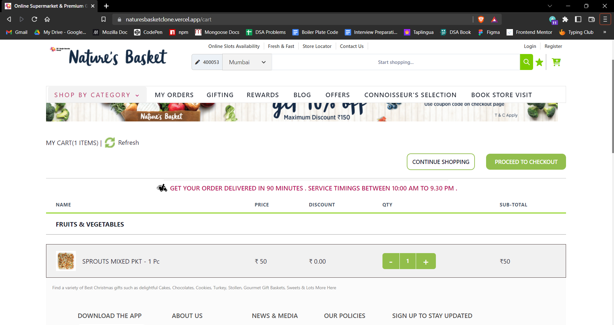

# Nature basket Clone

Hello everyone, I'm Jatin Khatter builded a clone of https://www.naturesbasket.co.in/ in my construct week of Unit-4 at Masai School. Link for my solution:-.

## Features

- Homepage with links to various sections.
- Login & signup pages with random otp feature and modal.
- Manual and automatic carousels.
- Animations on carousels.
- Sort & filter by many options on product page.
- Get a smooth experience in payment, login & signup process.

## Tech Stack

In this project we used following tech stacks:- 
- [HTML](https://developer.mozilla.org/en-US/docs/Web/HTML)
- [CSS](https://developer.mozilla.org/en-US/docs/Web/CSS)
- [JS](https://developer.mozilla.org/en-US/docs/Web/JavaScript)
- [Bootstrap](https://getbootstrap.com/docs/5.2/getting-started/introduction/)
- [React](https://reactjs.org/)
- [Webscrap](https://webscraper.io/)
- [Chakra UI](https://chakra-ui.com/getting-started)

## Screenshots

### 1. Home Page

### 2. Login Page

### 3. Signup Page

### 4. Products Page

### 5. Product View Page

### 6. Cart Page

### 7. Checkout Page

## Connect with author

- [Twitter]()
- [LinkdIn]()

## Feedback

If you have any feedback or queries, please reach out to me at jatinkhatter789@gmail.com.
